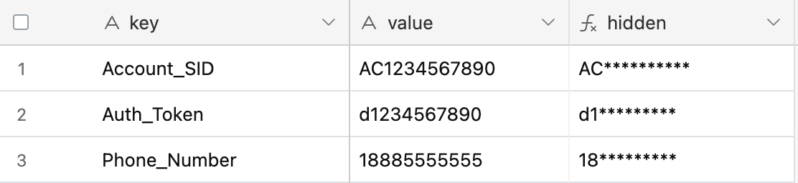

# Authentication
Code snippets used to retrieve secrets and use base64-encoding authentication, which is necessary for using Twilio APIs without an SDK.

## [secrets.js](/authentication/secrets.js)
script for storing secrets in a table so they aren't easily exposed.
  - This is optional; the secrets can be entered directly into the scrips

Example Secrets Table:

- The `value` field is typically hidden
- See [hidden field]() for the formula used to hide fields.
- Other secrets, such as Messaging Service SID and API URL, can be added as new field.

## [auth.js](/authentication/auth.js)
There are two ways to authenticate, depending on where and how a script is run
1. Browser Based
   -  `btoa()` [global function](https://developer.mozilla.org/en-US/docs/Web/API/btoa)
   - This works when running an Airtable script in your browser (i.e. pushing a button or hitting "Run").
2. Server Automation 
   - Minified version of [base64-encoding function](https://github.com/mathiasbynens/base64/blob/master/src/base64.js)
   - This is needed when running a script as an automation in airtable (when it runs on their server, not your browser)

Option 2: Server Automation would work in all cases, but requires some extra code, so I only use it when necessary. 

<!-- To Do: Include or link to examples -->